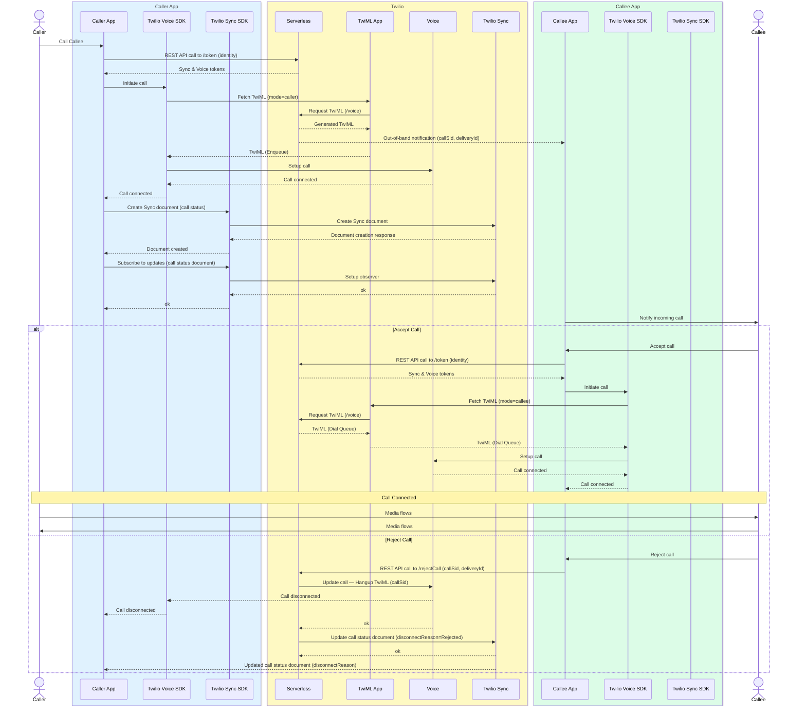

# Twilio Voice Android Demo — Delivery Hero

A demo Android application that connects a **caller** (e.g. a customer or dispatcher) and a **callee** (e.g. a delivery driver) through a Twilio Voice queue, without either party knowing the other's phone number. The backend is a [Twilio Serverless](https://www.twilio.com/docs/serverless/functions-assets/functions) service; the Android client uses the [Twilio Voice Android SDK](https://www.twilio.com/docs/voice/sdks/android) and [Twilio Sync Android SDK](https://www.twilio.com/docs/sync/sync-sdk-download#android-sdk)

```
┌─────────────────────┐        ┌──────────────────────┐
│  Android App        │        │  Twilio Serverless   │
│  (caller mode)      │──────▶ │  /token              │
│                     │        │  /voice  (TwiML)     │
│                     │        │  /rejectCall         │
│  Android App        │──────▶ │                      │
│  (callee mode)      │        │  Twilio Voice Queue  │
└─────────────────────┘        └──────────────────────┘
```

---

# Twilio Voice — Caller/Callee Call Setup & Accept/Reject Flow

This diagram documents the end-to-end call setup flow between a Caller App and Callee App using Twilio Voice SDK, Twilio Sync SDK, Serverless functions, and a TwiML App — covering token issuance, call setup, out-of-band callee notification, Sync-based call status tracking, and the accept/reject branches.

## Sequence Diagram



## Flow Summary

1. **Call initiation** — Caller App fetches a Voice + Sync token from Serverless and initiates the call via the Twilio Voice SDK.
2. **TwiML fetch & enqueue** — The Voice SDK hits the TwiML App, which in turn requests the actual TwiML from Serverless (`/voice`); the caller leg is enqueued.
3. **Out-of-band callee notification** — Serverless notifies the Callee App directly (push/out-of-band channel) with `callSid` and `deliveryId`, independent of the Voice signaling path.
4. **Call status tracking via Sync** — Caller App creates a Sync document to track call status and subscribes to updates on it.
5. **Callee decision (`alt` branch)**:
   - **Accept** — Callee App fetches its own tokens, initiates its Voice SDK call, fetches TwiML (`mode=callee`), and dials into the same queue — connecting both legs.
   - **Reject** — Callee App calls `/rejectCall`; Serverless issues a Hangup TwiML update to the caller's leg via the Voice API and updates the Sync document with `disconnectReason=Rejected`, which the Caller App picks up via its subscription.

## Repository Structure

```
.
├── android/          # Android Studio project (Java, min SDK 26)
│   └── app/
│       └── src/main/java/com/example/twiliovoice/MainActivity.java
└── serverless/       # Twilio Serverless Functions
    ├── functions/
    │   ├── token.js  # Vends Twilio Access Tokens
    │   └── voice.js  # TwiML webhook — enqueue or dequeue via queue name
    │   └── rejectCall.js  # Hangs up call and updates status in Twilio Sync
    ├── package.json
    └── .env.sample
```

---

## Prerequisites

- **Twilio account** — [sign up for free](https://www.twilio.com/try-twilio)
- **Node.js 22+** and **npm**
- **[Twilio CLI](https://www.twilio.com/docs/twilio-cli/quickstart)**
- **Android Studio** (Hedgehog 2023.1.1 or later recommended)
- A physical Android device or emulator running **API 26+**

---

## Part 1 — Deploy the Serverless Backend

### Step 1. Install the Twilio CLI and log in

```bash
npm install -g twilio-cli
twilio login
```

You will be prompted for your **Account SID** and **Auth Token**, both available on the [Twilio Console dashboard](https://console.twilio.com). Once logged in, the CLI creates and stores an API Key (`SKxxxx`) and secret — take note of these values.

### Step 2. Install the Serverless plugin

```bash
twilio plugins:install @twilio-labs/plugin-serverless
```

### Step 3. Create a TwiML Application

The Twilio Voice SDK needs a TwiML Application SID (`APxxxx`) to route outbound calls. Create one using the CLI, pointing `--voice-url` at the `/voice` function you are about to deploy.

> **Note:** You will update this URL after deployment in Step 6. For now you can use a placeholder and update it afterwards.

```bash
twilio api:core:applications:create \
  --friendly-name="dh-voice-demo" \
  --voice-method=POST \
  --voice-url="https://placeholder.twil.io/voice"
```

Copy the returned `APxxxx` SID — you will need it in the next step.

### Step 4. Configure environment variables

```bash
cd serverless
cp .env.sample .env
```

Edit `.env` with your credentials:

```dotenv
ACCOUNT_SID=ACxxxxxxxxxxxxxxxxxxxxxxxxxxxxxxxx
AUTH_TOKEN=xxxxxxxxxxxxxxxxxxxxxxxxxxxxxxxx
API_KEY_SID=SKxxxxxxxxxxxxxxxxxxxxxxxxxxxxxxxx
API_SECRET=xxxxxxxxxxxxxxxxxxxxxxxxxxxxxxxx
TWIML_VOICE_APP_SID=APxxxxxxxxxxxxxxxxxxxxxxxxxxxxxxxx
```

| Variable | Where to find it |
|---|---|
| `ACCOUNT_SID` | Console → API keys & auth tokens |
| `AUTH_TOKEN` | Console → API keys & auth tokens |
| `API_KEY_SID` | Console → API keys & auth tokens → API Keys |
| `API_SECRET` | Console → API keys & auth tokens → API Keys |
| `TWIML_VOICE_APP_SID` | Returned in Step 3 (format `APxxxx`) |

### Step 5. Install dependencies and deploy

```bash
npm install
twilio serverless:deploy
```

A successful deployment prints URLs like:

```
✔ Serverless project successfully deployed

Deployment Details
Domain: dh-app-backend-xxxx-dev.twil.io

Functions:
   https://dh-app-backend-xxxx-dev.twil.io/token  (protected)
   https://dh-app-backend-xxxx-dev.twil.io/voice
```

Copy your **domain** (`dh-app-backend-xxxx-dev.twil.io`) — you will need it in Part 2.

### Step 6. Update the TwiML Application with the real `/voice` URL

```bash
twilio api:core:applications:update \
  --sid APxxxxxxxxxxxxxxxxxxxxxxxxxxxxxxxx \
  --voice-url="https://dh-app-backend-xxxx-dev.twil.io/voice"
```

---

### How the backend works

**`/token`** — accepts a POST with an `identity` field and returns a short-lived Twilio Access Token containing a Voice Grant tied to your TwiML Application.

**`/voice`** — the TwiML webhook called by Twilio when the SDK places a call. It reads two parameters passed by the Android app:

- `deliveryId` — used as the Twilio queue name (sanitised to a safe string)
- `mode` — either `caller` (enqueues the call into the named queue) or `callee` (dials out of the named queue to connect to the waiting caller)

---

## Part 2 — Configure and Run the Android App

### Step 7. Open the project in Android Studio

Open the `android/` folder as an existing project in Android Studio. Let Gradle sync complete.

The app's dependencies (declared in `android/app/build.gradle`) are resolved from Maven Central automatically — no local SDK installation is required:

```groovy
implementation 'com.twilio:voice-android:6.+'
implementation 'com.squareup.okhttp3:okhttp:4.12.0'
```

### Step 8. Set your Serverless URL in `MainActivity.java`

Open `android/app/src/main/java/com/example/twiliovoice/MainActivity.java` and replace the placeholder with the token endpoint URL from Step 5:

```java
private static final String TOKEN_SERVER_URL =
    "https://dh-app-backend-xxxx-dev.twil.io/token";
```

### Step 9. Grant microphone permission

The `AndroidManifest.xml` already declares the required permissions:

```xml
<uses-permission android:name="android.permission.RECORD_AUDIO"/>
<uses-permission android:name="android.permission.INTERNET"/>
<uses-permission android:name="android.permission.MODIFY_AUDIO_SETTINGS"/>
<uses-permission android:name="android.permission.BLUETOOTH_CONNECT"/>
```

The app requests `RECORD_AUDIO` at runtime on first launch. Accept the prompt on your device.

### Step 10. Build and run

Connect an Android device (API 26+) or start an emulator, then press **Run** in Android Studio.

---

## Using the App

The app UI has two fields and two buttons:

| Field / Button | Description |
|---|---|
| **Identity** | A name for this device (e.g. `dispatcher`, `driver-42`) |
| **Delivery ID** | A shared key both parties enter — becomes the Twilio queue name |
| **Dial (caller)** | Enqueues this device into the named queue and waits |
| **Dial In (callee)** | Dials into the named queue, connecting to the waiting caller |

**Typical flow:**
1. The **caller** opens the app, enters an identity and a shared delivery ID, then taps **Dial**. The call is placed into a Twilio queue.
2. The **callee** (on a second device) enters the same delivery ID and taps **Dial In**. They are connected to the waiting caller.
3. Either party can **Mute** or **Hang Up** using the in-call controls.

---

## Environment Variables Reference

| Variable | Description |
|---|---|
| `ACCOUNT_SID` | Twilio Account SID (`ACxxxx`) |
| `AUTH_TOKEN` | Twilio Auth Token |
| `API_KEY_SID` | API Key SID (`SKxxxx`) — used to sign access tokens |
| `API_SECRET` | API Key secret — used to sign access tokens |
| `TWIML_VOICE_APP_SID` | TwiML Application SID (`APxxxx`) — included in the Voice Grant |

> ⚠️ Never commit `.env` to source control. It is already listed in `.gitignore`.

---

## More Documentation

- [Twilio Voice Android SDK — Getting Started](https://www.twilio.com/docs/voice/sdks/android/get-started)
- [Twilio Voice Android SDK — Javadoc](https://media.twiliocdn.com/sdk/android/voice/latest/docs/)
- [Twilio Serverless Functions](https://www.twilio.com/docs/serverless/functions-assets/functions)
- [Access Tokens for Voice](https://www.twilio.com/docs/voice/sdks/android/get-started#create-an-access-token)
- [TwiML `<Enqueue>` / `<Queue>`](https://www.twilio.com/docs/voice/twiml/enqueue)

---

## Issues and Support

Please file issues on this repository's [GitHub Issues](https://github.com/varun-maun-twilio/dh-twilio-voice-android-demo/issues) page. Do not include Personally Identifiable Information (PII), Account SIDs, API keys, or other credentials in issue reports.

## License

MIT
